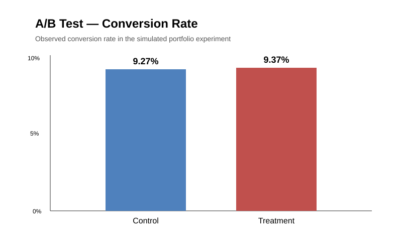

# A/B Testing & Conversion Optimization

> **Portfolio project:** statistical experimentation workflow using a public conversion dataset and a simulated treatment/control assignment.

## Executive summary

**Question:** Did the simulated product change improve conversion?

The treatment group converted at **9.37%** versus **9.27%** for control: a **+0.10 percentage-point** observed lift (about **+1.11% relative lift**). Both groups produced 559 conversions. The repository includes the Python statistical test, reproducible result snapshot, and executive visual.

**Decision principle:** the point estimate alone is not enough to ship a change. The analysis therefore evaluates statistical evidence and recommends checking confidence intervals, experiment duration, sample-ratio integrity, and guardrail metrics before rollout.

## Dashboard preview



### Supporting views

- Conversion by acquisition channel — `visuals/ab_channel_conversion.svg`
- Conversion by device — `visuals/ab_device_conversion.svg`
- Reproducible result table — `analysis/experiment_results.csv`

## Analysis workflow

1. Validate the experiment grain and required fields.
2. Confirm one row per user and valid control/treatment labels.
3. Calculate users, converters, conversion rate, absolute lift, and relative lift.
4. Run a two-proportion z-test.
5. Interpret the result conservatively rather than treating any positive point estimate as proof.
6. Translate the statistical result into a product decision framework.

## Dataset provenance

The underlying conversion dataset is public. A public source copy was supplied during project setup: `https://github.com/jainds/eda-for-conversion-rate-dataset`.

**Important:** the source dataset is not being claimed as original. The experiment framing, validation, Python implementation, statistical interpretation, visualizations, and business recommendations in this repository are independent portfolio work.

## Repository structure

```text
analysis/
  experiment_results.csv
  README.md
notebooks/
  ab_test_analysis.py
visuals/
  ab_conversion_rate.svg
  ab_channel_conversion.svg
  ab_device_conversion.svg
  README.md
```

## Tools

Python · pandas · statsmodels · Statistics · SQL · Power BI

## Portfolio boundary

This is a **simulated experiment for portfolio purposes**. It demonstrates how an analyst should evaluate an A/B test; it is not evidence from a real company experiment.
